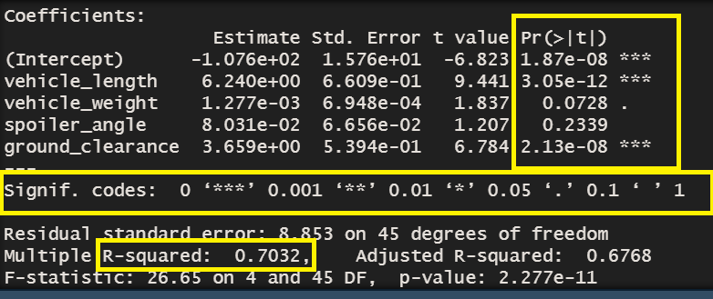
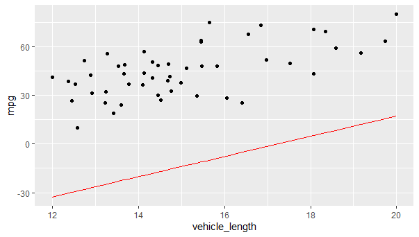
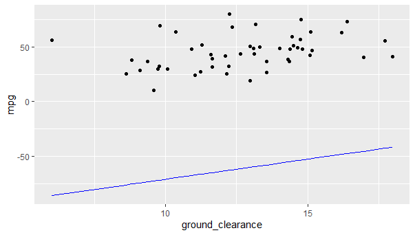
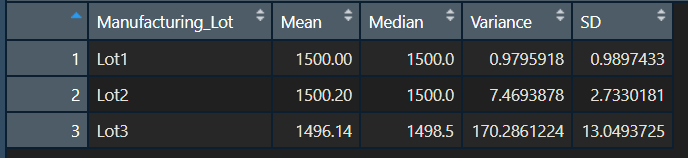
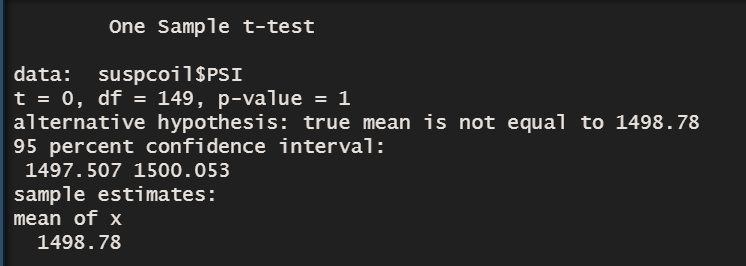
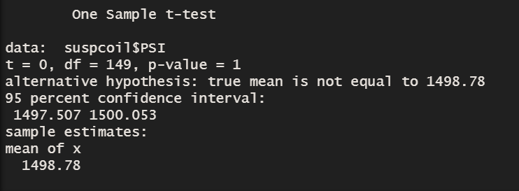

# MechaCar_Statistical_Analysis

## Linear Regression to Predict MPG
In the first analysis we are using the multi-line linear regression model against the MechaCar data. We include all the numerical and continuous variables in the formula.

The Summary of the linear regression model indicates that the vehicle_length and ground_clearance have a significant impact on the mpg.

R-Squared value of 0.7032 shows that these variables have 70% likelihood that the future data points will fit into the linear model. 
The p-value (2.277e-11) is extremely small indicating that even with a significance level of 0.0001 we can reject the null hypothesis. 
The slope of the line is 6.24 for vehicle_length and 3.65 for the ground clearance

## Summary Statistics on Suspension
In this analysis we create summary statistics for the dataset Suspension_Coil.csv. This dataset shows the Pounds per square inch (PSI) for each vehicle and manufacturing lot. The design specifications dictate that the variance of the suspension coils must not exceed 100 PSI. As we see from the charts below lot3 does not meet this specification

## T-Tests on Suspension Coils

As we see in the results, the p-value of 1 confirms the hypothesis one that there is no statistical difference between PSI across all manufacturing lots from the population mean of 1,500 pounds per square inch.

If we compare the PSI of each manufacturing lot against the mean of population we get the p-value of 1 that there is no statistical difference between the PSI of each manufacturing lot and the mean from population

## Study Design: MechaCar vs Competition.
### We want to find out how MechaCar rates against the competition in terms of cost and fuel efficiency:
- Merge the competitor data with mechacar data and add a categorical field "manufacturer" 
- The mpg and cost in all datasets must be numerical, continuous and normally distributed. Also the variance among each group should be very similar. 
- Add a new field called car-type example: compact, sedan, SUV, AWD etc.  
- Peform two ANOVA analysis for the cost, fuel efficiency (mpg) for the same type of car  
- summary(aov(mpg ~ manufacturer,data=mergeddata)) 
- summary(aov(cost ~ manufacturer,data=mergeddata)) 
- We treat "Pr(>F)" in results as our p-value statistic 
- Evaluate the null hypothesis which states that all groups are equal. 
if the Pr(>F) > 0.05 (Significance level) we can state the MechaCar is performing as well as its competitors

